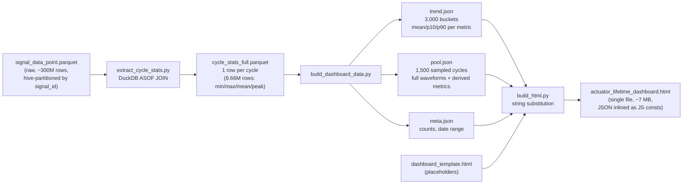
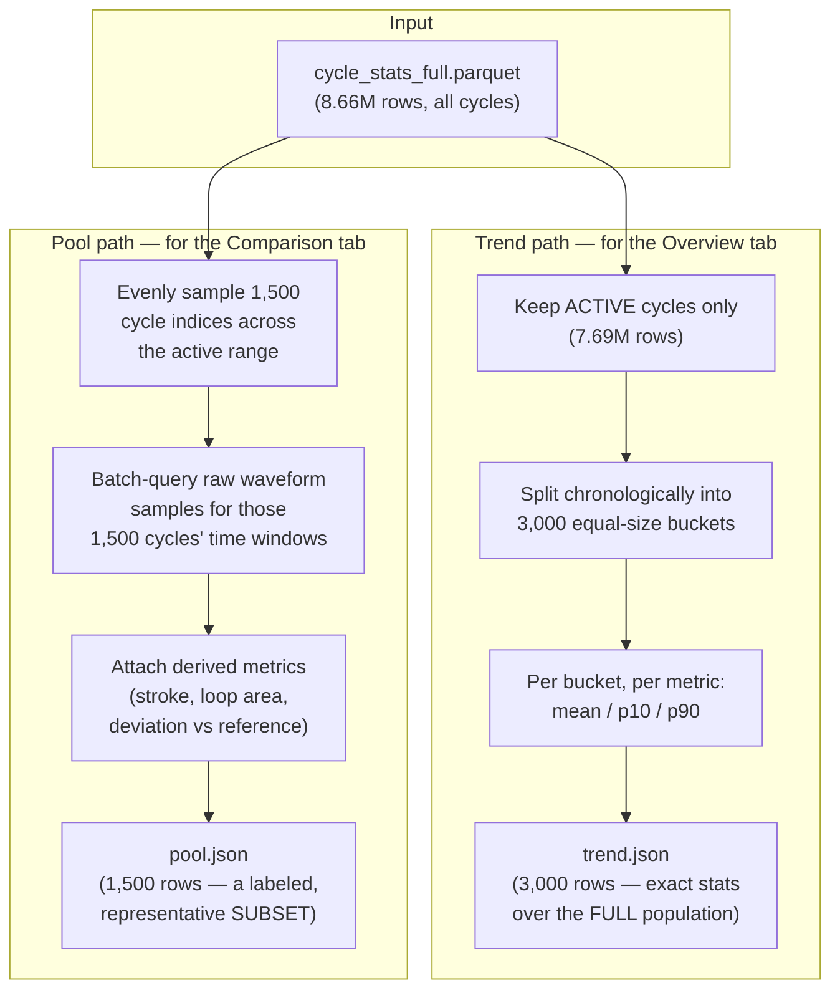
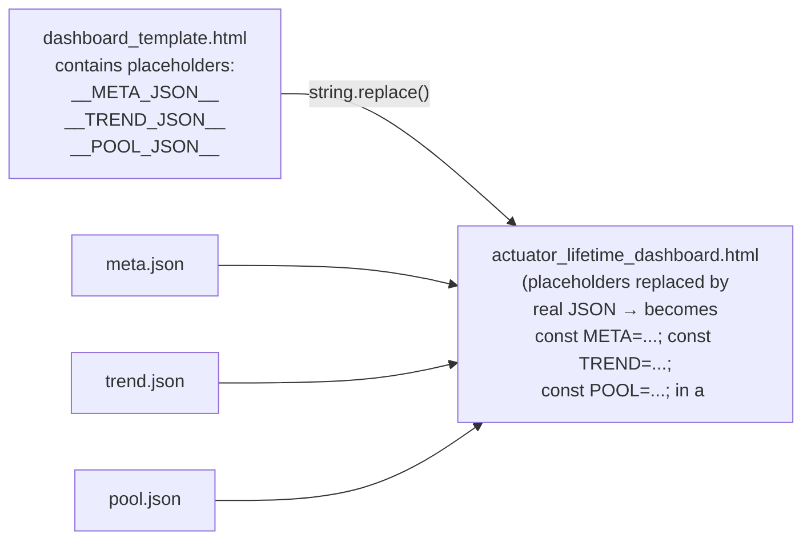
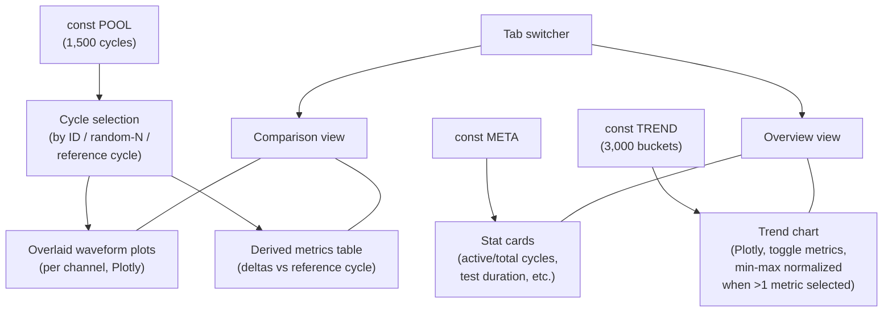

# Actuator Lifetime Dashboard — Architecture & Build Process

This document explains **how `dashboard_template.html`
(`/home/ita/ERA-NAS/reports/t1000/dashboard_template.html`,
final built artifact: `actuator_lifetime_dashboard.html`) works**, focusing on
the *principles* behind the design rather than line-by-line code.

Source of truth for the build scripts: `t1000/src/cycle_overlay/`
(`extract_cycle_stats.py`, `build_dashboard_data.py`, `build_html.py`).

---

## 1. The core problem

The D32/Versuch1 endurance test recorded **8,658,098 cycles** over ~184 days.
Each cycle has multiple continuous signals (velocity, position, current,
pressure, temperatures) sampled at up to 20 Hz. That is far too much raw
data to:

- load live into a browser,
- query on-the-fly without a backend/server, or
- embed in full resolution inside a single HTML file.

The dashboard's entire design revolves around one principle:

> **Aggregate and sample the data once, offline. Ship only the compact
> result. Let the browser do all the interactivity on that small dataset.**

This gives a single, self-contained HTML file that opens by double-click —
no server, no database, no live query engine — while staying honest in the
UI about what is exact (full-population stats) versus sampled
(waveform detail).

---

## 2. High-level pipeline (3 offline stages → 1 static file)



Each stage exists to shrink the data by orders of magnitude before it
reaches the browser:

| Stage | Input size | Output size | Reduction technique |
|---|---|---|---|
| 1. `extract_cycle_stats.py` | ~300M raw samples | 8.66M rows (1/cycle) | DuckDB ASOF join: collapse each signal to per-cycle min/max/mean/peak |
| 2. `build_dashboard_data.py` | 8.66M cycle rows | 3,000 trend buckets + 1,500 sampled cycles | Bucketed percentile summary + even sampling |
| 3. `build_html.py` | 3 JSON files | 1 HTML file | Placeholder substitution (no transformation) |

---

## 3. Stage 1 — `extract_cycle_stats.py`: from raw signal to per-cycle stats

- Uses the cycle-boundary table (`counter_v1_annot.parquet`, one timestamp
  per `Magnetschalter_Counter` increment) to define the start/end window of
  every cycle.
- For each of the continuous signals (velocity, position, current,
  pressure, motor/spindle/bearing temperature), DuckDB streams the
  partitioned parquet files and computes per-cycle aggregates
  (`vel_vpeak`, `pos_vmax`, `cur_vpeak`, `duration_s`, …) via an ASOF join
  against the boundary timestamps.
- Cycles flagged `is_active = False` (near the ~99 test pauses) are kept but
  excluded from later statistics.
- Result: **one row per cycle** for all 8.66M cycles — this is already a
  ~99% size reduction versus the raw signal stream, while still being
  "the whole population" (no sampling yet).

## 4. Stage 2 — `build_dashboard_data.py`: two different reduction strategies

This stage produces two *complementary* views of the same underlying data,
each solving a different UI need.



**Trend data (`trend.json`)** — answers "what does the whole 6-month life
look like?"
- Every *active* cycle contributes to some bucket — nothing is thrown away,
  it's summarized. mean/p10/p90 keep the chart honest about spread, not
  just an average line.
- This is why the Overview trend chart can legitimately claim to represent
  the full lifetime, not a sample.

**Pool data (`pool.json`)** — answers "what does an individual cycle's
waveform look like, and how do cycles compare to each other?"
- Embedding all 8.66M raw waveforms is infeasible, so 1,500 cycles are
  chosen by **even index spacing** across the active-cycle timeline
  (not random) — this guarantees uniform coverage from start to end of
  test life.
- For only these 1,500 cycles, the actual raw time-series (velocity,
  position, current, pressure, spindle temp) are extracted, batched into
  SQL queries of ~150 non-contiguous time windows at once (fast due to
  row-group pruning on sorted time).
- The dashboard UI explicitly labels this as *"cycles evenly sampled across
  the full test life... representative subset — embedding all cycles
  individually isn't feasible in one file"* — a deliberate transparency
  choice, not a hidden shortcut.

## 5. Stage 3 — `build_html.py`: assembling the single file

Purely mechanical — no data transformation:



The result is copied to both the pipeline's own `output/` folder and the
browser-facing report path
(`/home/ita/ERA-NAS/reports/t1000/dashboard_template.html`).

---

## 6. Client-side (browser) architecture

Once loaded, the HTML file is a fully self-sufficient single-page app.
No network calls except the Plotly.js CDN script.



Key interaction principles:

- **Two tabs, two granularities.** "Overview" = exact full-population trend
  (from `TREND`); "Comparison" = detailed per-cycle waveform exploration
  (from `POOL`, capped at 1,500 cycles).
- **Unit-scale normalization for multi-metric trend view.** Velocity
  (~1e4) and position (~1e2) differ by orders of magnitude; selecting more
  than one trend metric normalizes each to its own 0–100% range so smaller
  series remain visible, while hover tooltips always show the true raw
  value.
- **Nearest-cycle snapping.** Typing an arbitrary cycle ID snaps to the
  nearest cycle actually present in the 1,500-cycle pool, since arbitrary
  IDs outside the pool have no embedded waveform.
- **No server, no build step at view-time.** All state lives in JS
  variables (`selected`, `hidden`, `highlighted`, `activeChannels`,
  `activeTrendMetrics`); every interaction just re-renders Plotly traces
  from the already-inlined `META`/`TREND`/`POOL` constants.

---

## 7. Why this design is "honest by construction"

- The trend chart is computed from **all** active cycles — it is not a
  sample, so lifetime drift/degradation claims from it are statistically
  valid.
- The comparison view is explicitly labeled as a **representative subset**
  (1,500 of 8.66M), so nobody mistakes a nice overlay chart for "every
  cycle ever recorded."
- Units are kept as-is from `units.parquet` metadata even where magnitudes
  look unusual (e.g., velocity ~±70,000), rather than inventing a rescaling
  — flagged in the dashboard footer.
- There is no literal force/torque channel; the "loop area" metric is
  clearly a current-vs-position proxy (shoelace formula), not a true
  hysteresis loop, and is named/commented as such.

---

## 8. Regenerating the dashboard

From `t1000/src/cycle_overlay/` (its own `.venv` with duckdb/pandas/pyarrow):

```bash
.venv/bin/python extract_cycle_stats.py     # ~1 min — Stage 1
.venv/bin/python build_dashboard_data.py    # ~1 min — Stage 2
.venv/bin/python build_html.py              # instant — Stage 3
```

Output: `t1000/src/cycle_overlay/output/actuator_lifetime_dashboard.html` and
`/home/ita/ERA-NAS/reports/t1000/dashboard_template.html` (browser-facing
copy), both ~7 MB, single-file, double-click to open.
