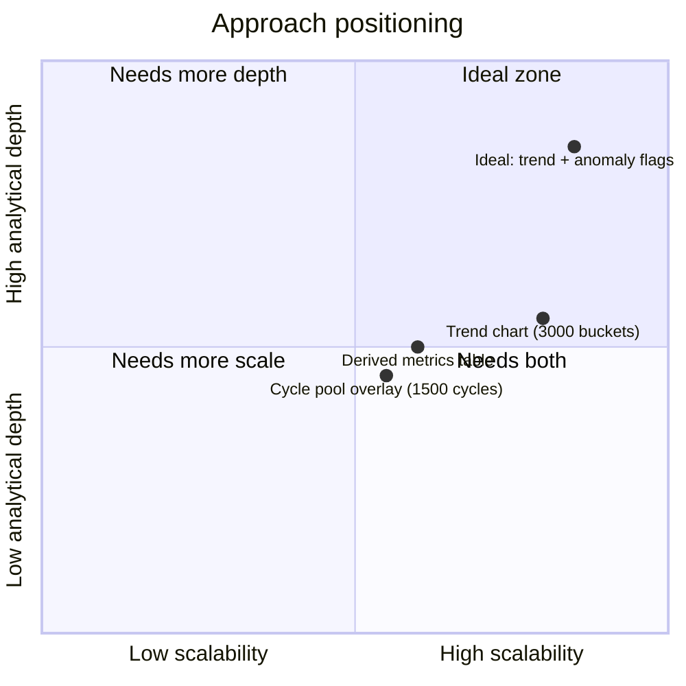

# Review: Visualization & Comparison Approach — Actuator Lifetime Dashboard

A critical assessment of the visualization/comparison design used in
`actuator_lifetime_dashboard.html` (built from `t1000/src/cycle_overlay/`).
This complements `dashboard_architecture.md` (which explains *how* it
works) by evaluating *how good* the approach is for the analysis goal:
spotting wear/drift/degradation across the D32/Versuch1 6-month test.

---

## 1. Summary judgment

The two-tier design (exact full-population **trend** view + a labeled
**representative-sample** detail view) is a sound, honest solution to an
otherwise infeasible data volume problem. Its main weaknesses are not in
the pipeline architecture but in the **statistical and visual choices
within each tier** — sampling strategy, aggregation granularity, and the
lack of automated anomaly/change-point detection to guide the eye.

---

## 2. Strengths

### Data reduction & performance
- **DuckDB ASOF join / streaming aggregation** avoids ever materializing
  the ~300M-row raw signal table in Python — the pipeline scales to the
  full dataset without needing more RAM as data grows.
- **Two independent reduction strategies for two different questions**
  (bucketed percentiles for "the whole lifetime shape", even sampling for
  "individual cycle waveform detail") is the right call — a single
  reduction method could not serve both needs well.
- **Single self-contained HTML file**: no server, no live database, no
  auth — trivially shareable and reproducible; works long after the
  original data/infra is gone.

### Statistical honesty
- Trend chart is computed from **all 7.69M active cycles**, not a sample
  — lifetime drift claims from it are statistically defensible.
- **p10/p90 shaded bands**, not just a mean line, show spread/variability
  per bucket — this is more informative than a bare trend line and helps
  distinguish "the process shifted" from "the process got noisier."
- The comparison pool is **explicitly labeled** as a representative
  subset (1,500 of 8.66M cycles), so users can't mistake it for full
  coverage — this is a genuinely good practice, often skipped in ad-hoc
  dashboards.
- Units are kept as recorded (no invented rescaling), and the "loop area"
  metric is clearly flagged as a current-vs-position **proxy**, not a true
  force/torque hysteresis loop — prevents over-interpretation.

### Visual design
- **Even (not random) index-based sampling** for the pool guarantees
  uniform coverage across the full test timeline — no early/late bias.
- **Okabe–Ito colorblind-safe palette** for overlaid cycle traces —
  accessible by default.
- **Per-metric min-max normalization** when multiple trend metrics are
  overlaid solves a real problem (velocity ~1e4 vs. position ~1e2 would
  otherwise make one series invisible), while hover tooltips preserve the
  true raw value — good balance of readability vs. fidelity.
- **Reference-cycle diffing** (Δ stroke, Δ peak velocity, Δ peak current
  vs. a chosen reference) turns raw overlays into an actionable
  degradation signal instead of requiring visual estimation.
- Highlight/hide/opacity controls in the comparison view let a user
  reduce visual clutter interactively rather than being stuck with a
  fixed rendering.

---

## 3. Weaknesses

### Sampling & statistical granularity
- **Fixed bucket/pool sizes (3,000 / 1,500) are arbitrary constants**, not
  derived from the data's actual variability or change-point structure.
  A degradation that happens in a short burst (e.g. a maintenance event)
  could be diluted across a bucket or fall between two of the 1,500
  sampled cycles and be invisible.
- **No anomaly or change-point detection.** The dashboard is purely
  descriptive — a human has to visually scan the trend chart or manually
  add/compare cycles to notice degradation. There's no flagging of
  outlier cycles, sudden shifts, or statistically significant drift.
- **Percentile choice (p10/p90) is fixed and not configurable.** Extreme
  but rare degradation events (e.g. the top/bottom 1%) are invisible in
  the shaded band and could only be found by chance if they land in the
  1,500-cycle pool.
- **No correlation across metrics or signals.** Everything is presented
  per-metric independently; there's no way to see, e.g., "does peak
  current rise together with spindle temperature?" without manually
  cross-referencing two separate charts/tables.
- **Test pauses / known events aren't annotated** on the trend chart —
  the ~99 pauses are filtered out of the "active" stats but not marked as
  vertical reference lines, so a viewer can't correlate a trend shift
  with a specific real-world event (e.g. maintenance, part change).

### Comparison-view scalability & readability
- **Overlay of many cycles becomes a "spaghetti plot."** With random-N
  sampling up to 200 cycles, or several manually added cycles, the
  waveform overlays can become visually unreadable despite the
  opacity/highlight controls — there's no automatic small-multiples or
  heatmap fallback for large N.
- **Single fixed reference cycle** for delta calculations. Comparing
  against only the first pool cycle (or a manually picked one) doesn't
  show *how the deviation itself evolves* over time — a rolling reference
  or drift-rate metric would be more diagnostic of gradual wear.
- **No time-aligned overlay validation.** Waveforms are aligned by
  "ms since cycle start," but cycle duration varies slightly
  (`duration_s` differs cycle to cycle); overlaying by raw time index can
  visually misrepresent phase-shifted degradation (e.g. a slower stroke)
  as a shape difference rather than a timing difference.
- **Pool is fixed at build time.** If a user wants to inspect a cycle
  outside the 1,500-cycle pool, they only get the *nearest* pool cycle
  silently substituted — useful for browsing, but could mislead a user
  who thinks they're looking at the exact cycle they typed.

### Analytical completeness
- **No statistical significance / confidence quantification** on the
  observed trend changes (e.g., is a shift in mean peak velocity between
  early and late test life larger than expected sampling noise?).
- **No cross-test-unit comparison.** The design is scoped to
  Versuch1 only; if Versuch2/Versuch3 or other actuator units are
  eventually compared, the current architecture (single embedded pool,
  single meta block) doesn't generalize without rework.
- **Slow signals (motor/bearing temp) are single snapshots per cycle**,
  not full waveforms, in the pool view — acceptable given their sample
  rate, but this means fine-grained thermal transients within a cycle are
  invisible even in "detail" mode.

### Practical/operational
- **~7 MB file size** is on the larger side for casual sharing (e.g.
  email attachments, chat tools may compress or reject it), even though
  it is much smaller than the raw data.
- **Regeneration is a 3-step manual pipeline** (`extract_cycle_stats.py`
  → `build_dashboard_data.py` → `build_html.py`); there's no single
  entry-point script or Makefile target, so re-running after new data
  arrives requires remembering the correct order.
- **No embedded provenance/version metadata** in the HTML itself (e.g.
  which data snapshot / git commit / generation timestamp produced this
  exact file) — makes it harder to verify freshness of a shared file
  later.

---

## 4. Suggested improvements (prioritized)

| Priority | Improvement | Addresses |
|---|---|---|
| High | Add vertical markers for known pause/maintenance events on the trend chart | correlating shifts with real causes |
| High | Add a simple change-point / rolling-baseline-deviation flag on the trend metrics | reduces reliance on manual visual scanning |
| Medium | Make reference cycle "rolling" (e.g. mean of first N cycles) or show delta-vs-reference *as its own trend line* | better wear/drift quantification |
| Medium | Cap/aggregate overlay rendering (e.g. auto-switch to a density/heatmap view above ~30 selected cycles) | comparison view scalability |
| Medium | Normalize waveform time axis by `% of cycle duration` as an alternate view, not just raw ms | avoids conflating timing shift with shape shift |
| Low | Single orchestrating script/Makefile for the 3-stage pipeline | operational convenience |
| Low | Embed a small provenance block (generation date, source snapshot) in the HTML footer | traceability of shared files |

---

## 5. Bottom line

The approach is **appropriate and well-justified for the scale
constraint** (single-file, offline, 8.66M cycles), and unusually careful
about **statistical honesty and labeling of what is exact vs. sampled**.
Its main gap is that it stops at *descriptive* visualization — it gives a
capable human plenty of correct, honestly-labeled data to look at, but
does none of the automated flagging (anomalies, change points, event
correlation) that would be needed to reliably catch subtle or short-lived
degradation without manual, exhaustive visual inspection.
